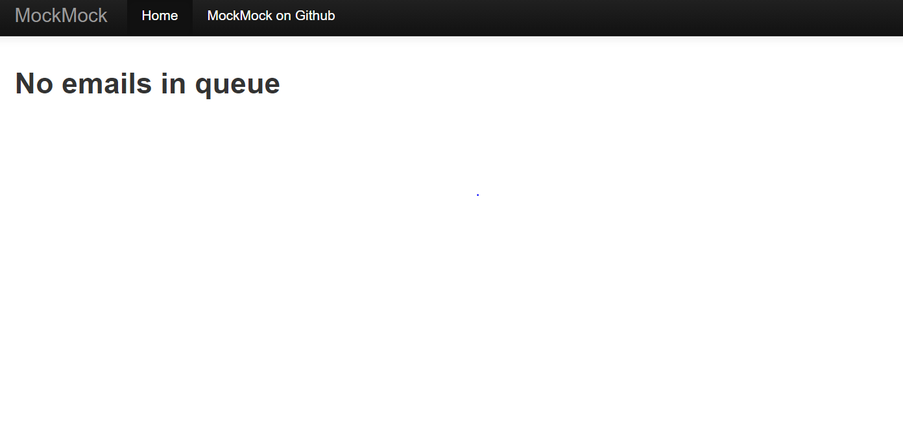

# Labo_SMTP_RES_2021

[](https://github.com/AxelVallon/Labo_SMTP_RES_2021/actions/workflows/maven.yml)

## Description du projet

Ce projet est un client qui permet à son utilisateur d'envoyer automatiquement d'une adresse mails à plusieurs autres adresses email une blague, et sans authentification.

## Serveur Mock

Vous trouverez dans le dossier `docker`, 4 fichiers qui vous permettront de mettre en place votre propre serveur Mock, qui vous permettront de tester cette application, sans avoir besoin d'envoyer les email aux adresse email ciblées.

Les fichiers pour cette mettre en place cette configuration sont les suivants :

`docker/build_images.sh`: Script pour créer l'image docker

`docker/Dockerfile`: fichier de configuration docker

`docker/MockMock.jar`: binaires du serveur Mock utilié

`docker/run.sh`: Script pour lancer le container

### Procédure installation

**Attention** : Veuillez noter que cette procédure d'installation a été vérifiée sur Windows, mais devrait être fonctionnels sur d'autre système.

**Requirement :** Afin d'utiliser ce serveur Mock, il vous faudra préalablement avoir installé Docker. (https://docs.docker.com/get-docker/)

**Etapes ** 

1. Clonez ce repository

2. Lancer le script build_image.sh

   ```bash
   #!/bin/bash
   
   docker build --tag axel/mock-server .
   ```

   Ce script va simplement build une image en locale avec le dockerfile. La création de l'image peut prendre un peu de temps.

3. Lancer le script run.sh

   ```bash
   #!/bin/bash
   
   # we open 2 ports on the server because we need port 25 for SMTP and port 8282 
   # for the web view of the system
   docker run -p 25:25 -p 8282:8282 axel/mock-server 
   ```

   Ce script va runner le conteneur, et ouvrir les ports 25 et 8282 en local, donc faites attention au fait que vous ne les utilisez pas déjà au préalable. Si vous utilisez déjà un de ces ports, vous pouvez les changer en modifiant les ports utilisé par le serveur dans le ficher `Dockerfile`,  avec une modification de la compilation sur le serveur avec `java -jar MockMock.jar -p SMTPPORT -h WEBPAGEPORT`, et modifier donc aussi après les ouverture de port  locale dans le script `run.sh`.

4. Maintenant que le docker est allumé et fonctionnel, vous pouvez essayer d'accéder à l'interface web du serveur Mock, en accédant à l'adresse http://localhost:8282/. Vous devriez avoir accès à la page suivantes :

   

5. Maintenant, vous pouvez vérifier les paramètres de configuration de connexion de l'application pour qu'il se connecte au bon serveur SMTP, dans le fichier

   //TODO explication sur le fichier de configuration


## Implémentation

La schéma relationnel de cette application est le suivant :

//TODO copier schéma dans dossier figures et pointer dessus


#### sendMails

Nous allons seulement présenter un élément dans cette partie, et est la fonction qui permet d'envoyer des mail à tous les groupes configurés.

```java
/**
     * Permet d'envoyer les mails à tous les groupes configuré avec des contenu de mail alléatoires
     * @throws IOException
     */
    public void sendMails() throws IOException {
        Random rand = new Random();

        //Parcours des groupes, pour chaque groupe un email est envoyé
        for(Group group : config.getGroups()) {
            /** Configuration des entrées sorties **/
            Socket socket = new Socket(config.getHostname(), config.getPort());
            PrintWriter os =
                    new PrintWriter(socket.getOutputStream(), true);
            BufferedReader in =
                    new BufferedReader(
                            new InputStreamReader(socket.getInputStream(), StandardCharsets.UTF_8 ));
            /** Fin configuration entrées sorties **/

            /** Convertation d'envoi de mail avec le serveur SMTP **/
            startWith(in.readLine(), "220 ");
            os.println("EHLO server");
            //attente sur 250 HELP
            String tmp;
            do {
                tmp = in.readLine();
                startWith(tmp, "250");
            } while (!tmp.startsWith("250 "));

            os.println("MAIL FROM: <" + group.getSender().getEmail() + ">");
            startWith(in.readLine(), "250 ");

            for (Victim recipient : group.getRecipients()) {
                os.println("RCPT TO: <" + recipient.getEmail() + ">");
                startWith(in.readLine(), "250 ");
            }
            os.println("DATA");
            startWith(in.readLine(), "354 ");

            // Séléection aléatoire d'un message
            Message message = messages.get(rand.nextInt(messages.size()));

            os.println(forgeEmailContent(group, message));
            os.println("\r\n.\r\n");
            startWith(in.readLine(), "250 ");
            os.println("QUIT");
            startWith(in.readLine(), "221 ");
            /** Fin de conversation avec le serveur SMTP **/

            socket.close();
            in.close();
            os.close();
        }
    }
```

Cette fonction est utilisé, qui permet une connexion au serveur SMTP, est en fait une conversation avec le serveur SMTP. Ce protocole est soumis à une quantité de norme qui nous assure un comportement à peu près fixe, et l'avantage de cette norme est de pouvoir implémenter ce client qui est fonctionnel dans n'importe quel contexte. 

Donc pour développer cette fonction, nous avons suivi la norme disponible ici : https://tools.ietf.org/html/rfc5321

Elle contient toute les détails du protocole défini par la RFC 5321, soit du protocole SMTP. 

Vous trouverez un exemple tiré du document ci-dessus, qui vous montreras comment fonctionne ce protocole, et vous permettra donc aussi de comprendre comment a été mis en place le client ci-dessus : 

```
S: 220 foo.com Simple Mail Transfer Service Ready
      C: EHLO bar.com
      S: 250-foo.com greets bar.com
      S: 250-8BITMIME
      S: 250-SIZE
      S: 250-DSN
      S: 250 HELP
      C: MAIL FROM:<Smith@bar.com>
      S: 250 OK
      C: RCPT TO:<Jones@foo.com>
      S: 250 OK
      C: RCPT TO:<Green@foo.com>
      S: 550 No such user here
      C: RCPT TO:<Brown@foo.com>
      S: 250 OK
      C: DATA
      S: 354 Start mail input; end with <CRLF>.<CRLF>
      C: Blah blah blah...
      C: ...etc. etc. etc.
      C: .
      S: 250 OK
      C: QUIT
      S: 221 foo.com Service closing transmission channel
```

 

### Contenu rapport

Your report MUST include the following sections:

- **A brief description of your project**: if people exploring GitHub find your repo, without a prior knowledge of the RES course, they should be able to understand what your repo is all about and whether they should look at it more closely.
- **Instructions for setting up a mock SMTP server (with Docker - which you will learn all about in the next 2 weeks)**. The user who wants to experiment with your tool but does not really want to send pranks immediately should be able to use a mock SMTP server. For people who are not familiar with this concept, explain it to them in simple terms. Explain which mock server you have used and how you have set it up.
- **Clear and simple instructions for configuring your tool and running a prank campaign**. If you do a good job, an external user should be able to clone your repo, edit a couple of files and send a batch of e-mails in less than 10 minutes.
- **A description of your implementation**: document the key aspects of your code. It is probably a good idea to start with a class diagram. Decide which classes you want to show (focus on the important ones) and describe their responsibilities in text. It is also certainly a good idea to include examples of dialogues between your client and an SMTP server (maybe you also want to include some screenshots here).